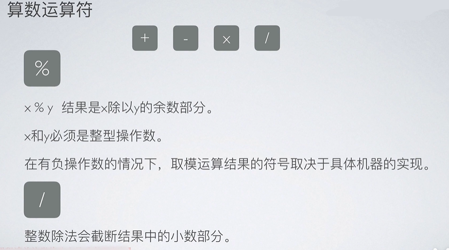

# C 语言四种基础数据类型

     char 字符型          （一般一个字节长度，存放一个字符）
     int 整型             （4个字节）
     float                单精度浮点型
     double               双精度浮点型

# 施加在基本类型上的限定符

short int a; //int可省略不写

long  int a; //int可省略不写

short限定符尽可能的使int变短，long尽 可能的使int变长。

short 和 int类型不小于16位，int型可以是 16位和32位，long类型不小与32位， 具体由所在机器而定。

signed 与 unsigned可用来限定char型和所有整型( 包括被short或long限定过的整型)

signed 整型等价于整型。

unsigned 整型使得原有整型长度不变，符号位变成了数据位，仅能表示0和正数。

signed char强制char可以存储有符号整数,unsigned char强制char可以存储无符号整数. char不加任何限定，则是否有符号根据所在机器而定。

# 类型转换
1.自动转换

1.强制转换
（类型名）表达式
    ·float(a)   //将变量a转化为 float 类型
    ·(int)(x+y) //将表达式 x+y的结果转化为 int 型
    ·(float)5   //将数值5 转换为 float 类型
    
# 运算符

